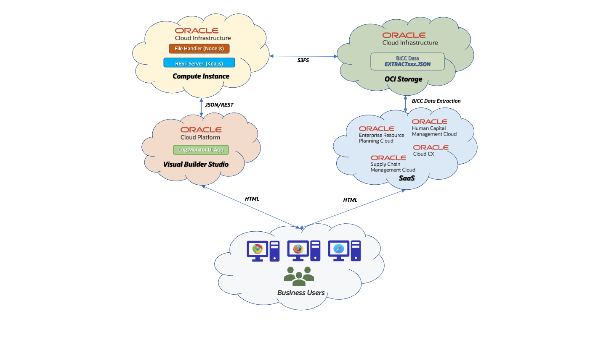

# BICC Extract Status Monitoring REST Service

## Products Involved

* Oracle SaaS 20.B or higher
* Oracle Cloud Infrastructure 19.4.x (optional)
* Oracle Visual Builder Service 19.4.x (optional)

## Third Party Software Used

* Node.js 18.12.1
* Koa.js 2.13.4 including depending modules
	* koa-body 4.2.0
	* koa-logger 3.2.1
	* koa-router 10.1.1
	* koa-static 5.0.0

## Introduction

This application provides a sample how the EXTRACT JSON files for BICC extracts can be read, accumulated and published by various REST services for further processing and UI rendering. These JSON files are created during a BICC job execution and list the statistics for this run like used View Objects, timings, status information etc. 

## High level architecture

As shown in the figure below this code will read JSON files from a mounted network resource. These files will be parsed and accumulated in memory. Via a Koa web server function there are multiple REST API's that provide dedicated views on these data. The content of this service can be refreshed by another REST API call that will re-read the directory and update the internal data structures. According to the asynchronous processing nature of *Node.js* this call may take some time depending on the volume of data to be handled.

This solution was developed in order to demonstrate the capabilities of reading the EXTRACT JSON files produced by BICC and the consolidated review of those data. The results are existing as JSON Array Structures internally and will be accessible via various REST API's.  

Possibly changed JSON structures in future releases were not available during writing this code. The code has made running and  been tested against Oracle SaaS BICC Release 20C.

The application has been tested against the 3rd party software versions as listed above. We might assume that it will even run with more recent releases, but that hasn't been tested before and is a task of adopters premise when using this solution.

## Functional Overview

It has been tested in an OCI environment where the BICC output has been written into an OCI Object Storage bucket. The *Node.js* code was running in a OCU Compute Cloud Linux instance. The OCI Storage bucket was shared as a network filesystem on the OCI Linux machine. This way there is no specific download of these JSON files necessary and the program would read and evaluate always the actual files at runtime. Via a special REST service **/refreshDataREST** it is possible to reload these JSON files. Such an API call can be scheduled as a job or run from anywhere to ensure the consumers are always retrieving actual data.
As the program takes only one mandatory paramater - the directory name containing the JSON files - this program would work with any BICC EXTRACT JSON files independently of being existent on an OCI Object Storage or locally.
This solution was developed in order to demonstrate the capabilities of reading the EXTRACT JSON files and consolidation of those data. The REST API's can be called by any post-processing tool using these data for analytical purposes, customer interactions via UI or integration processes. 

## Installation

The installation of this asset is two-fold: in a first step the required tech stack - here *Node.js* and *Koa.js* - must be installed and configured on an OCI Compute Instance. Also the required BICC configuration for an extract to OCI Object Storage and the creation of a Network Mount between OCI Object Storage and OCI Compute Instance is a required task. For a quick function test the application itself could run on any PC/Mac - part of this asset are some sample JSON files that can be used. However, the installation for a Cloud environment is more complex and documented in detail.

In a second step we have to configure the security features to ensure that these REST calls are using encrypted data and the calls can only be performed by authenticated users. To avoid injecting the JavaScript code with additional security features we've chosen the option to put the REST server behind an OCI API Gateway and to use IDCS for a management of privileges.

The detailed steps for an according installation are available in detail as follows:

* The creation of an end-to-end configuration to extract BICC extract files to OCI Object Storage including the ability to run the app provided in this asset via *Node.js* for parsing and provisioning of a REST API via *Koa.js* is available in PDF file **docs/Install\_Configure\_BICC\_Extract\_Log\_REST\_APIs.pdf**
* The implementation of an additional security configuration vi API Gateway and IDCS can be found in PDF file **docs/Secure\_BICC\_Extract\_Log\_REST\_APIs.pdf** in this asset 

## Implementation Scenario covered 

### Processing JSON files

By running this application all available files in a given directory are read and processed. The file naming of looks like this:

* `EXTRACT_STATUS_DATA_SCHEDULE_<SCHEDULE_ID>_REQUEST_<JOB_ID>.JSON`
* `EXTRACT_STATUS_PRIMARY_KEYS_SCHEDULE_<SCHEDULE_ID>_REQUEST_<JOB_ID>.JSON`

The program collects all data found into JS arrays and creates program structures as separate internal arrays that will be returned as JSON content when doing the various REST calls. 

After processing these JSON files a REST server will be started via *Koa.js* with the following specifications:

* if not specified differently by a parameter the listening port of this server is *3000*
* if not specified differently by a parameter the listing IP address is *127.0.0.1*
* if not specified differently by a paramter there is **no** log output
* if the given directory is not accessible or can't be read the program execution will be stopped with an according status message
* if no specific REST API is given - means just opening the URL in a browser as is - a static *index.html* will be opened and shown providing a documentation about the available services
* if no suitable JSON files exist, but might be produced at a later time, the REST API */refreshDataREST* can be used to reread the directory and to rebuild the internal structures
* the *refreshDataREST* call can be executed at any time or also scheduled to ensure the latest files will be processed
* none of the REST API's requires a parameter and all are called by using a GET method

The following REST API's were implemented:

| **REST API**                | **Description**
| -------------------------------------| ----------------------------
| **/reportStatsREST**            | return the statistics and summaries of all processed files
| **/byDateREST**      | return all log information ordered by run date 
| **/byNameREST**      | return all log information ordered by VO name 
| **/bySchedIDREST**       | return all log information ordered by Schedule ID 
| **/byFailStatusVOREST**       | return all log information of failed extracts ordered by VO name 
| **/byFailStatusDateREST**       | return all log information of failed extracts ordered by run date 
| **/refreshDataREST**       | initiate another  file reading and processing to refresh the REST data 

The following fields are read and processed as read from the  various JSON files:

* **name**
* **status**
* **runDate**
* **queryDurationInSec**
* **extractDurationInSec**
* **uploadDurationInSec**
* **totalDurationInSec**
* **rowCount**
* **errorMessage**

The following fields are **not** part of the processed JSON elements - more elements might be added in BICC in future and are out of scope for this documentation:

* **code**
* **connDurationInSec**
* **metadataDurationInSec**
* **readDurationInSec**

## Content of this code repository

The code repository contains two sub-directories holding the ICS exports and Java code for this asset.

| **File/Directory**                | **Description**
| -------------------------------------| ----------------------------
| **/public**            | directory with a static file *index.html* that documents the existing REST API's 
| **/sample_files**      | a collection of sample files that can be used for a program validation for those cases where no other BICC Log Files exist 
| **/test_results**      | a collection of sample JSON files that have been returned from various REST API testing
| **/docs**              | directory containing PDF files with the detailed instruction for an installation and configuration
| **biccLogServer.js**      | the Node.js program code as is 
| **package.json**       | this package configuration 

## Running the sample code

The application provided here can be tested as is by using the provided test data. The following tasks are required

* if not done yet install *Node.js* in the release as listened on top
* please do the same for *Koa.js*

To execute the program run on command line:

`node biccLogServer.js <BICC JSON Log directory>`

If running  the program without any parameter the caller will receive a standard usage message listening the available paramaters.

In case the program has been started like shown above the web site can be opened in a browser by opening the following URL:

`http://<localhost>:3000`

The application will remain running in foreground until being interrupted by Ctrl-C. It has been tested and it works to run the program behind a *nohup* command and to put in into background.

If the refresh of log data is a demand it can achieved by running a command  like this:

`curl http://<localhost>:3000/refreshDataREST`

## Further Information

For further information on how this solution works including details about this application is being embedded in a bigger picture, you can find a more detailed architecture overview on the **[A-Team Chronicles blog page](http://www.ateam-oracle.com)** for the [configuration](https://www.ateam-oracle.com/bicc-extract-logs-monitoring-on-oci-native) and [security setup](https://www.ateam-oracle.com/bicc-securing-extract-logs-rest-services).

Developers choosing to distribute a binary implementation of this project are responsible for obtaining and providing all required licenses and copyright notices for the third-party code used in order to ensure compliance with their respective open source licenses.

Copyright (c) 2022, Oracle and/or its affiliates. 
Licensed under the Universal Permissive License v 1.0 as shown at https://oss.oracle.com/licenses/upl.
